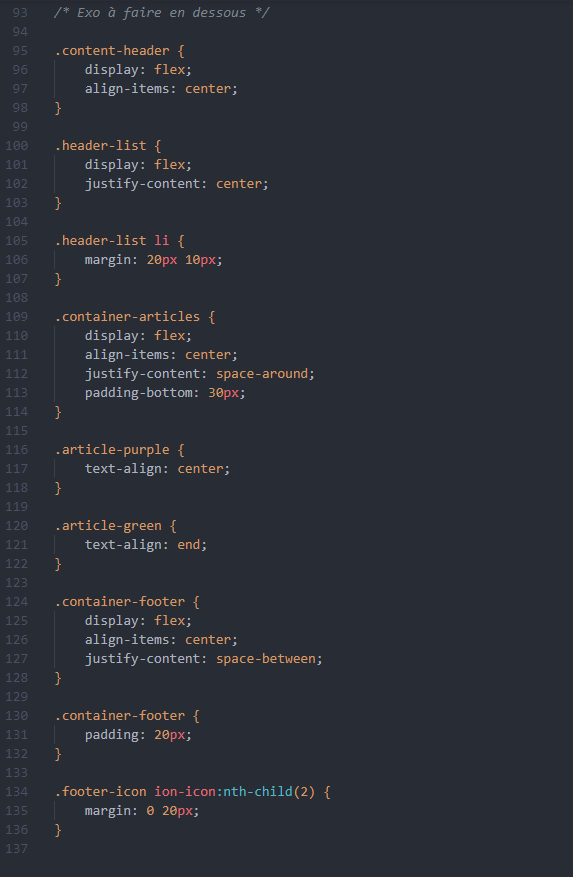

# Correction exercice difficile

Voici donc les lignes de code (il ce peu que vous ayez géré quelques propriétés différemment, le but est d'être au plus proche du rendu final).

Encore une fois on pense *"boite"*

> Pas mal de display...

Oui, beaucoup de `display: flex;` pour les activer, et pourtant s'est se qu'on va avoir le plus souvent sur des sites (par la suite avec des framework CSS on pourra mieux le gérer, en Scss par exemple on pourra créer des variables appelés *"mixin"* qui portera un nom *personnalisable* et qui aura plusieurs propriétés/valeurs dedans comme le `display: flex;` `align-items: center;` `justify-content: center;` pour directement centrer les éléments sans avoir à répéter ces lignes de code).

Comme on le voit, rien de très compliqué finalement quand on comprend comment fonctionne les flexbox.

La petite astuce quand on a un élément et qu'on veut cibler celui du milieu, comme pour les icons du footer, on utilise cette fameuse et très utile pseudo-class `:nth-child()`.

La on cible le 2éme élément et on lui dit d'ajouter 20px de marge à droite et à gauche, se qui permet d'espacer les 2 autres icons sans ajouter de marge extérieure à la 1er et 3éme icons.

Je ne fais pas un gros résumé de tout le code, je pense que tu as compris en voyant le résultat se qu'il fallait chercher à faire, mais je suis sûr que tu as réussis :)

> Bien sûr, et je n'ai plus peur de flexbox, s'est devenu mon meilleur ami et allié :)