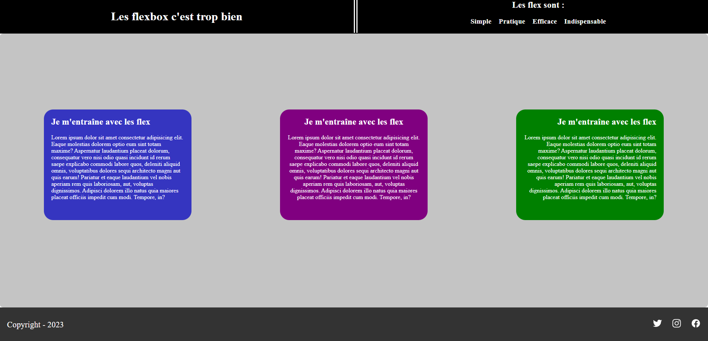

# Consigne flexbox difficile

*Prélude :*

En soi il n'a rien de *"difficile"*, juste que la il y aura un gros mélange de `flexbox`, avec quelques `align-items`, et quelques `margin/padding`.

Pas besoin de reproduire au pixel prêt l'image final, si tu mets une marge de 10 ou 15px alors que j'ai mis 20, on s'en fiche. Le principal s'est que le rendu et comportement de la page soit le même.

Dans le HTML ne t'occupe pas des dernières ligne avant la fermeture du body, on verra ça en Javascript, ça sert juste pour avoir des petites icones (footer).

Pour les class HTML je n'ai pas utilisé la méthode BEM, mais si tu veux refaire la partie HTML pour t'entraîner, cela peut faire un bon entraînement.

Pour ce cas-là, on reste focus sur le CSS.

## Revenons à nos moutons ! 

On démarre avec une page toute éclatée au sol que voici...

> Non, c'est vrai? heureusement que tu le dis car je pensais que tout était nickel sur ce rendu...

En effet, le rendu est ... dégueulasse xD. Mais le stagiaire (il faut toujours une bonne poire), n'a pas codé la totalité... donc il faut faire toute sa partie pour un rendu plus propre.

> Je vais essayer

Fais de ton mieux, je sais que ce n'est pas facile, mais on compte sur toi pour résoudre ce souci.

Voici le rendu final :

C'est un mélange de tous se qu'on a vu jusque-là (flexbox facile et moyen), avec un ajout de quelques gestions de `text-align` et `margin/padding` comme précisé plus haut (prélude).

*Pssst, un indice, l'un des éléments du footer utilise une pseudo-class, mais tu peux le gérer comme tu veux, c'est juste une astuce en plus*

Donc pas de pression et bon courage !
